&nbsp;

&nbsp;

 

## About

Currently a **Regional Development Team Manager at Ocado Logistics**, running daily dispatch operations for a 140+ van fleet across Central and West London — live scheduling, incident handling, and keeping delivery performance on target.

Underneath that: a Mechanical Engineering background (IMechE-accredited) in CAD and FEA, and a practical software streak — I build tools that solve real problems (cost estimators, finance trackers, gesture recognition systems) and bring first-principles engineering thinking into every data and automation project.

 📫 Open to roles in **data, automation, and systems engineering** — UK-wide.

 

&nbsp;

## Featured Projects

| Project | What it does | Stack |
|---|---|---|
| [ML-Hand-Gesture-Recognition](https://github.com/JGit705/ML-Hand-Gesture-Recognition) | Real-time hand gesture classification using machine learning | Python |
| [Personal-Finance-Tracker](https://github.com/JGit705/Personal-Finance-Tracker) | Tracks income, expenses, and budget targets with data visualisation | JavaScript |
| [3D-Printer-Cost-Estimator](https://github.com/JGit705/3D-Printer-Cost-Estimator) | Calculates material cost, print time, and job pricing for FDM printing | Python |
| [Engineering Portfolio](https://jamal-lharri-portfolio.vercel.app/) | Personal site — CAD models, FEA work, and engineering projects | TypeScript |

<b>Engineering project highlights</b>

 

- **Autonomous Vehicle System** — C++ robot control, sensor integration, and pathfinding algorithms
- **Fluid Mechanics Study** — MATLAB data processing pipeline with ±4% experimental accuracy
- **FEA Bending Analysis** — ABAQUS structural simulation and stress analysis
- **Hydrogen Techno-Economic Dissertation** — cost modelling, emissions analysis, and policy scenarios

## Skills

**Languages & Data**  

**Tools & Workflow**  

**Engineering & CAD**  
| | | |
|---|---|---|
| `SolidWorks` | `ABAQUS` | `ANSYS` |
| `Fusion 360` | `Onshape` | `AutoCAD` |
| `Simulink` | | |

## Currently

- 🚚 Managing regional dispatch operations for 140+ vehicles at Ocado Logistics
- 🔧 Deepening SQL — schema design, indexing, Python integrations
- 🏗️ Building out the [engineering portfolio](https://jamal-lharri-portfolio.vercel.app/)
- 🎯 Looking for early-career roles in data, automation, or systems engineering

## Languages

 
