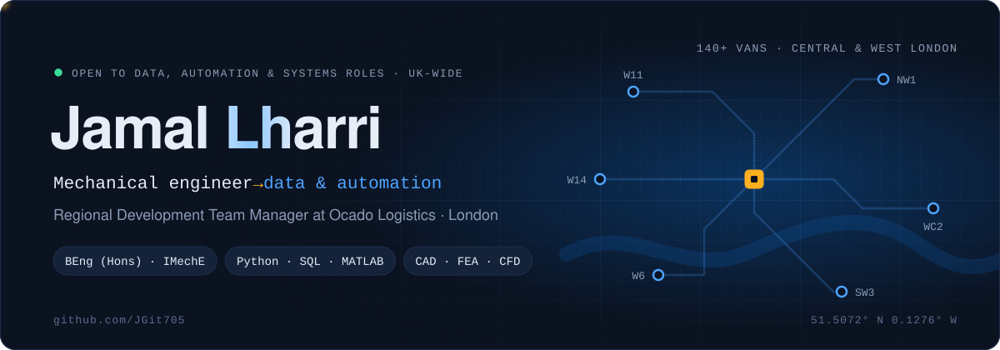
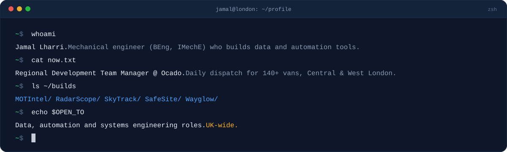
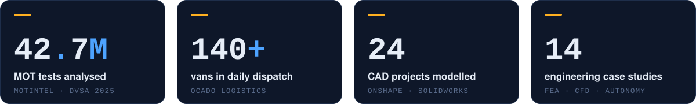
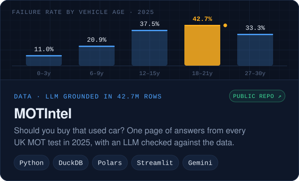
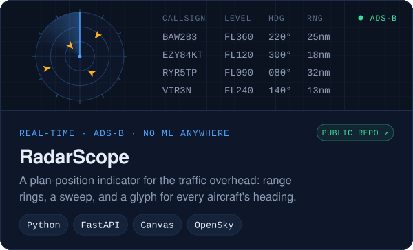
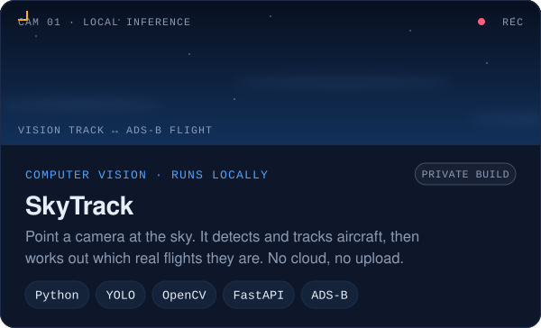
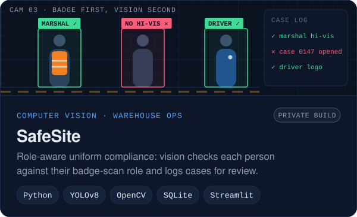
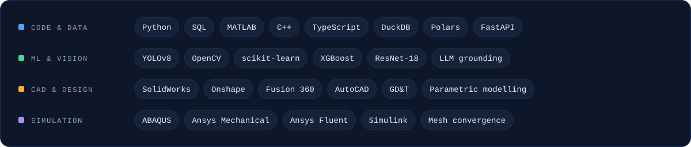
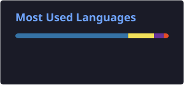

  

## About

I run daily dispatch for a **140+ van fleet across Central and West London** at Ocado Logistics: live scheduling, incident handling, and keeping delivery performance on target.

My background is a **BEng (Hons) in Mechanical Engineering, IMechE accredited**, in CAD, FEA and CFD. It taught me to model the system, test the assumption and measure the result. I now bring the same approach to software, building tools on real data that are honest about what the data can and cannot tell you.

## Selected work

<b>More builds</b>

 

| Project | What it does | Stack |
|---|---|---|
| **Wayglow** private | A world map where the places you've been glow. One codebase ships as a website and as iPhone and Android apps | TypeScript, Vite, Capacitor, Supabase |
| [3D Printer Cost Estimator](https://github.com/JGit705/3D-Printer-Cost-Estimator) | Upload an STL file and get material, energy and depreciation costs for the print | Python, Streamlit |
| [ML Hand Gesture Recognition](https://github.com/JGit705/ML-Hand-Gesture-Recognition) | Classifies five hand gestures using transfer learning on ResNet-18 and AlexNet | MATLAB |
| [Personal Finance Tracker](https://github.com/JGit705/Personal-Finance-Tracker) | Client-side dashboard that imports bank CSVs and categorises spending | JavaScript |
| [Engineering Portfolio](https://jamal-lharri-portfolio.vercel.app/) | 24 CAD projects and 14 case studies across FEA, CFD and autonomous vehicles | TypeScript |

<b>Engineering highlights</b>

 

- **Hydrogen techno-economic dissertation:** cost modelling, emissions analysis and policy scenarios for hydrogen production and use
- **FEA bending analysis:** structural simulation and stress analysis in ABAQUS
- **Fluid mechanics study:** MATLAB data processing pipeline, accurate to within ±4% of experiment
- **Autonomous vehicle system:** C++ robot control, sensor integration and pathfinding
- **Dual-axis Scotch yoke and robot gripper:** animated multi-part mechanism assemblies in Onshape

## Toolbox

## Activity

<picture>
  <source media="(prefers-color-scheme: dark)" srcset="https://raw.githubusercontent.com/JGit705/JGit705/output/github-contribution-grid-snake-dark.svg"/>
  
</picture>

  

<!-- The SVGs in profile/assets are generated. Edit profile/build.py and run: python3 profile/build.py -->
